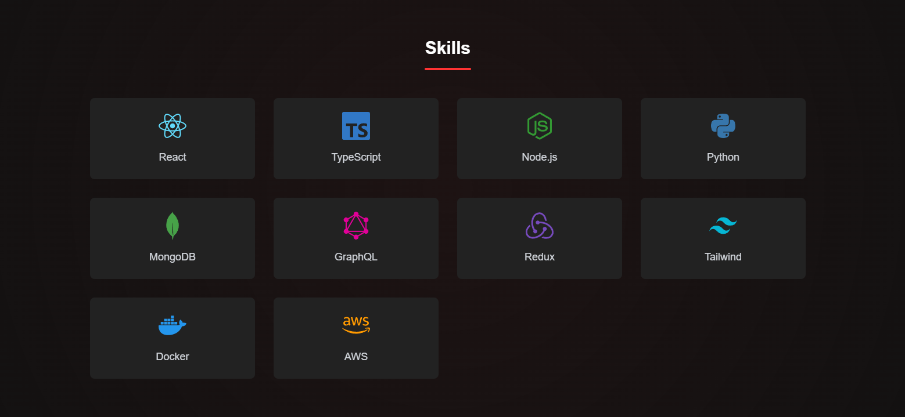

# 🚀 Modern Portfolio Website

A modern, customizable portfolio website built with React, Next.js, and Framer Motion. This portfolio features smooth animations, responsive design, and an intuitive user interface.


## ✨ Features

- **📱 Responsive Design**: Fully responsive layout that looks great on all devices
- **🎨 Customizable**: Easy to customize with your own content and styling
- **🎭 Smooth Animations**: Beautiful transitions and animations using Framer Motion
- **🌓 Dark/Light Mode**: Toggle between dark and light themes
- **⚡ Fast Performance**: Optimized for speed using Next.js
- **📊 Interactive Sections**: Engaging user interface with interactive elements

## 🛠️ Built With

- [React](https://reactjs.org/) - Frontend library
- [Next.js](https://nextjs.org/) - React framework
- [Framer Motion](https://www.framer.com/motion/) - Animation library
- [Styled Components](https://styled-components.com/) - Styling
- [React Icons](https://react-icons.github.io/react-icons/) - Icons
- [TypeScript](https://www.typescriptlang.org/) - Type safety

## 📋 Sections

1. **Hero Section**
   - Animated introduction
   - Profile image
   - Social media links

2. **About Me**
   - Professional summary
   - Skills and technologies
   - Personal interests

3. **Experience**
   - Work history
   - Interactive timeline
   - Skill tags

   

4. **Projects**
   - Project showcase
   - Live demos
   - GitHub links

   

5. **Skills**
   - Highlight of technologies
   - Interactive skill showcase

   

6. **Contact** (work in progress)
   - Contact form
   - Social media links
   - Location map

## 🚀 Getting Started

### Prerequisites

- Node.js (v14 or higher)
- npm or yarn

### Installation

1. Clone the repository:
```bash
git clone https://github.com/yourusername/portfolio.git
